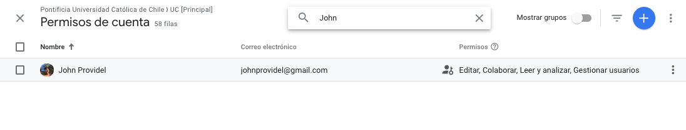

# Administración de usuarios

En este apartado podemos administrar los accesos de usuario. Si bien la administración esta a nivel de cuenta, podemos administrar los permisos de usuario a nivel de propiedad y de vista.

Los permisos que podemos asignar a nuestros usuarios son:

1. Editar: Puede crear y editar propiedades, vistas, filtros, objetivos, etc. No puede gestionar usuarios
2. Colaborar: Puede crear y editar elementos compartidos, como paneles y anotaciones.
3. Leer y analizar: Puede ver datos de informes y de configuración.
4. Gestionar usuarios: Puede añadir o eliminar usuarios y cambiar sus permisos.

