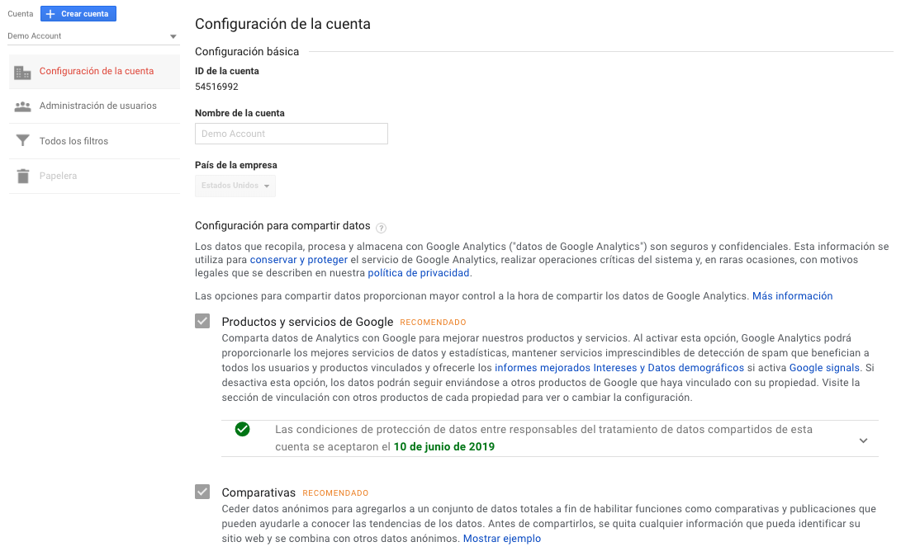
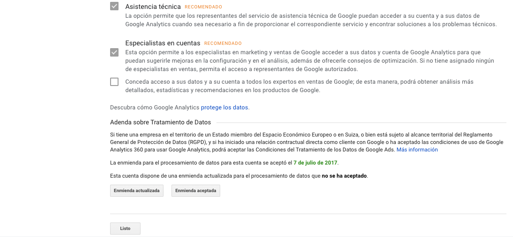

# Configuración de la cuenta

Es la configuración inicial al momento de crear una cuenta.

Aquí podremos configurar y revisar los siguiente items:

* ID de la cuenta: identificador de la cuenta creada
* Nombre de la cuenta: el nombre definido para nuestra cuenta. Es posible cambiarla.
* País de la empresa: es el país en donde se encuentra nuestra empresa u organización.
* Configuración para compartir datos: entrega las opciones para compartir nuestros datos con Google con el fin conservar y proteger el servicio de Google Analytics. Todas las opciones son recomendaciones y no es obligatorio seleccionarlas.

