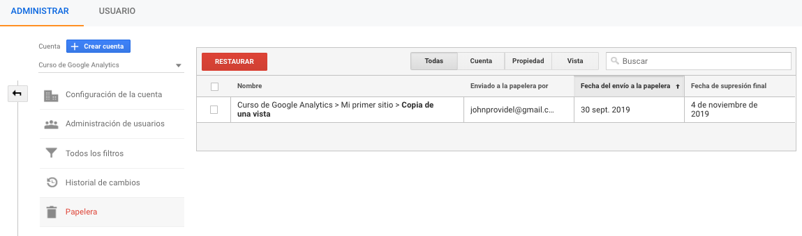

# Papelera

En la opción "Papelera" podremos ver todas las cuentas, propiedades o vistas que hayamos eliminado, con la posibilidad de poder restaurarlas en un plazo máximo de 35 días desde el momento que se elimino.

Al momento de restaurar podremos recuperar toda la configuración previa que haya tenido la cuenta, propiedad o vista, pero solo podremos recuperar los datos desde el momento que se elimino. Una vez que se restaura nuestra cuenta, los datos se seguirán procesando.

