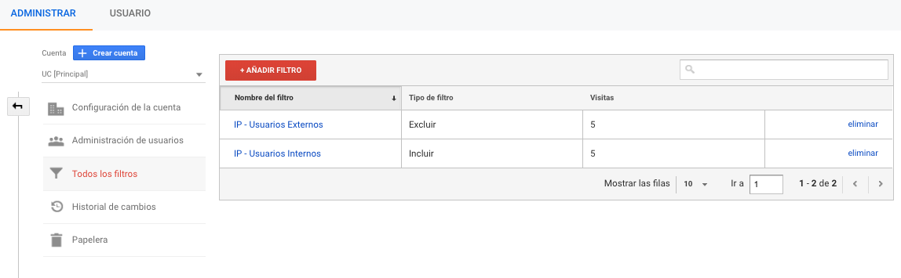
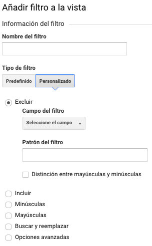

# Todos los filtros

En esta sección podemos crear filtro de datos para asociarlos a nuestras distintas vistas.

Existen filtros predefinidos y también podemos crear filtros personalizados.

Entre los filtros predefinidos encontramos:

1. Incluir o excluir tráfico de las direcciones IP
2. Incluir o excluir tráfico del dominios del ISP
3. Incluir o excluir solo el tráfico al nombre de host
4. Incluir o excluir solo el tráfico a los subdirectorios

En cada filtro podemos incluir o excluir datos, así como podemos aplicar una expresión como: "que son iguales a", "que empiezan por", "que terminan por" o "que contienen" dependiendo del valor que agreguemos en el tipo de filtro predefinido.

En los filtros personalizados podemos crear distintas tipos, que nos permite excluir o incluir valores de campos definidos en analytics, también distinguir entre mayúsculas o minúsculas, buscar y reemplazar cadenas, o generar un filtro avanzado.

