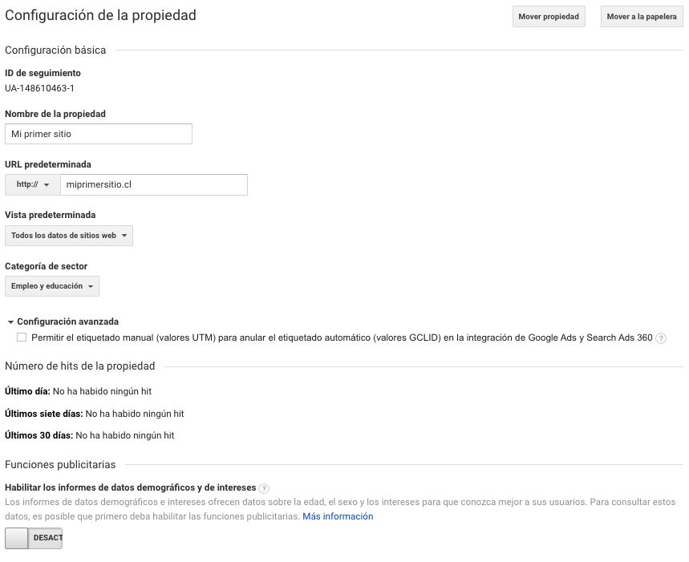
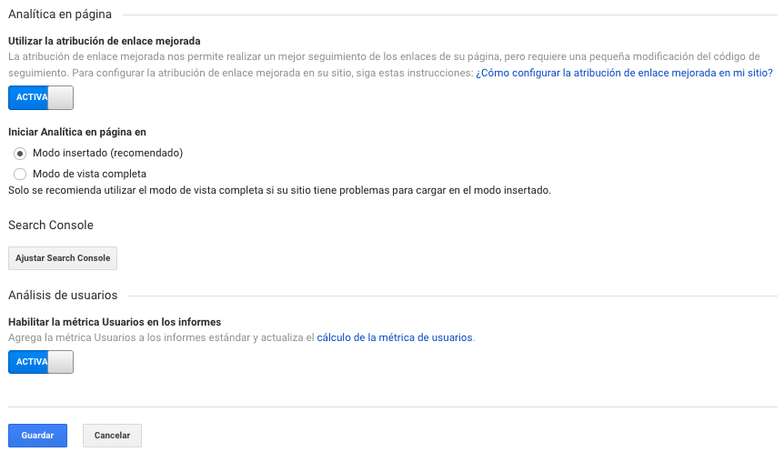

# Configuración de la propiedad

En la configuración de la propiedad podremos ver 6 items de configuración como: 

1. **La configuración básica** en donde podremos ver la ID de seguimiento, nombre de la propiedad, URL de la propiedad, seleccionar una vista predeterminada, seleccionar la categoría del sector de nuestro negocio, y una configuración avanzada para el etiquetado manual con Google Ads y Search Ads 360.
2. Podremos revisar el **número de hits de la propiedad** del último día, últimos 7 días y en último mes. 
3. Habilitar las **funciones publicitarias** para activar los datos demográficos y de interés.
4. Opción de **analítica en la página**, en donde podremos utilizar o habilitar la atribución de enlace mejorada para hacer un seguimiento correcto de los enlaces de la página.
5. Podremos configurar o **enlazar con Google Search**.
6. Y **habilitar la métrica de usuarios** en los informes para obtener información interacción de usuarios y usuarios activos con nuestra web.

