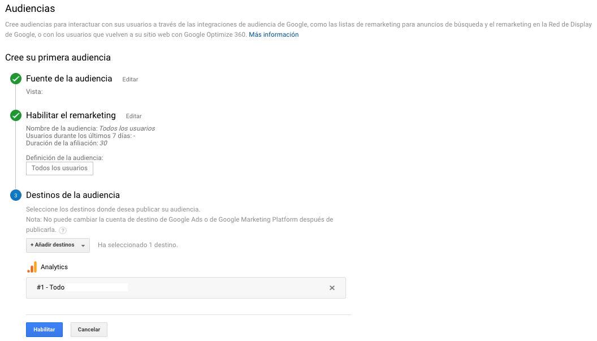

# Definiciones de la audiencia

Nos permite definir tipos de audiencias de acuerdo a las integraciones como las listas de remarketing para anuncios de búsqueda y el remarketing en la Red de Display de Google, o con los usuarios que vuelven a su sitio web con Google Optimize 360.

Tipos de audiencia:

* Lista inteligente
* Todos los usuarios
* Usuarios nuevos
* Usuarios recurrentes
* Usuarios que hayan visitado una sección específica de mi sitio web/aplicación
* Los usuarios que han conseguido una conversión de objetivo
* Usuarios que han realizado una transacción

