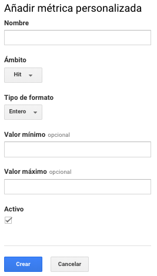

# Definiciones personalizadas

Dentro de esta sección podremos crear las dimensiones o métricas personalizadas. Las dimensiones son atributos dentro de Google Analytics y las métricas son valores cuantitativos de las dimensiones.

Una dimensión puede crearse con los siguientes ámbitos:

* Hit
* Sesión
* Usuario
* Producto

Una métrica puede crearse con los siguientes ámbitos:

* Hit
* Producto

Y pueden ser de tipo:

* Entero
* Moneda \(Decimal\)
* Tiempo

Es importante que la gran diferencia de una definición es que las métricas personalizadas puede calcularse.

