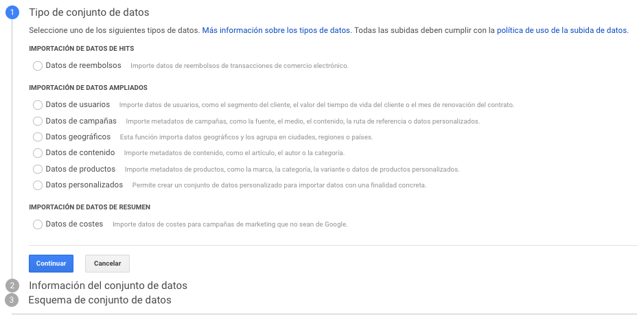

# Importación de datos

La información de datos sube archivos de texto que contienen datos externos a una propiedad de Analytics. Esta información normalmente se exporta desde una herramienta empresarial offline \(por ejemplo, el sistema CRM o CMS\).

Hay dos formas de subir datos a Google Analytics:

* En la interfaz de usuario de Analytics, seleccione **Administrador &gt; \(Propiedad\) &gt; Importación de datos**.
* Utilice la API de administración de Analytics.

