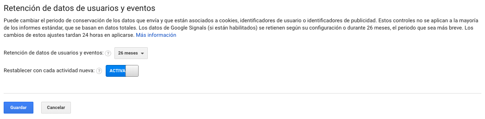
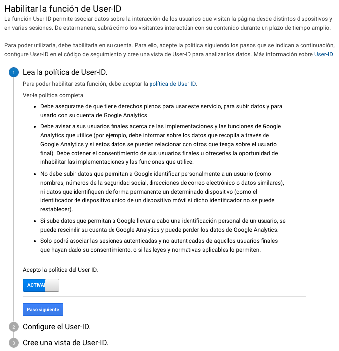
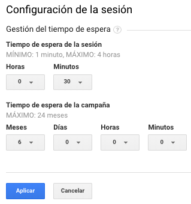
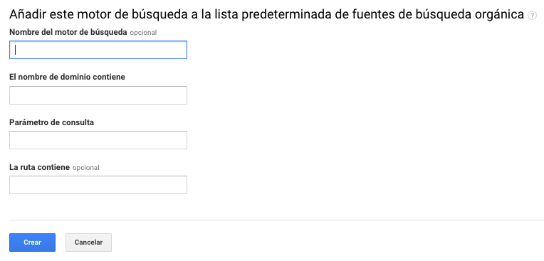
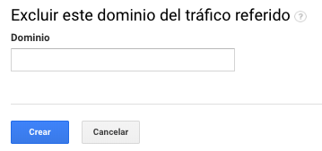
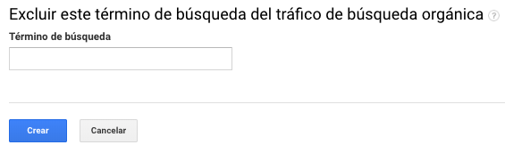

# Información de seguimiento

Esta opción nos permite ver la configuración de la información de seguimiento, recogida y retención de datos, user ID, etc.

### Código de seguimiento

En esta sección podemos revisar el ID de seguimiento de nuestra propiedad, el estado de tráfico de nuestro sitio web, el código de seguimiento o etiqueta, etiquetas de web conectadas, y otras implementaciones de código como Google Tag Manager.

### Recogida de datos

Dentro de esta sección podremos habilitar las opciones de **recogida de datos para funciones publicitarias o de remarketing**. 

Permite habilitar la obtención de datos para Display y Search Remarketing.

Adicionalmente permite habilitar  las funciones para los informes publicitarios, como informes de interés y datos demográficos de audiencia, los de Campaign Manager, los de Display y Video 360.

### Retención de datos

Nos permite configurar hasta cuanto tiempo podemos **retener la información o la data de usuarios y eventos** en nuestra vista de analytics.

Podremos **retener por un periodo de tiempo los datos de usuarios** y eventos por 14, 26, 38 y 50 meses o podemos optar por sin una fecha de caducidad.

También se puede optar por **reestablecer con cada actividad nueva**, esto quiere decir que por cada sesión que el usuario genere dentro del plazo establecido, sus datos se retienen. En caso contrario si no existe actividad los datos se eliminaran.

### User ID

Desde esta sección podremos habilitar la función de **User-ID** que nos permite asociar los datos de  distintos dispositivos, sesiones y otros datos de interacción a un mismo usuario.

La asociación de un ID de usuarios debe ser implementado dentro de nuestra plataforma asignando nuestros propios ID únicos por usuarios y deberá ser configurada en el código de seguimiento gtag.js, analytics.js.

### Configuración de la sesión

En analytics podremos configurar el tiempo de espera de las sesiones de usuarios y el tiempo de espera de las campañas.

Se recomienda dejar esta configuración en su defecto para no afectar los datos. 

Los valores recomendados son:

* 30 minutos por sesión
* 6 meses por campaña

### Fuentes de búsqueda orgánica

Esta opción nos permite agregar otras fuentes orgánicas de búsquedas no identificadas por analytics que no solo son Google, Yahoo o Bing. Solo funciona con la versión de analytics.js del código de seguimiento.

### Lista de exclusión de referencia

Esta opción nos permite excluir todos los dominios del tráfico referido. Cualquier de los dominios que agreguemos, Google Analytics no los contabilizara como tráfico referido en los informes. 

### Lista de exclusión de términos de búsqueda

Podremos excluir todos los términos de búsquedas que Analytics identifica en los motores de búsqueda, logrando que cualquier término buscado en Google u otro buscador, no sea considerado como tráfico orgánico si no como tráfico directo.

