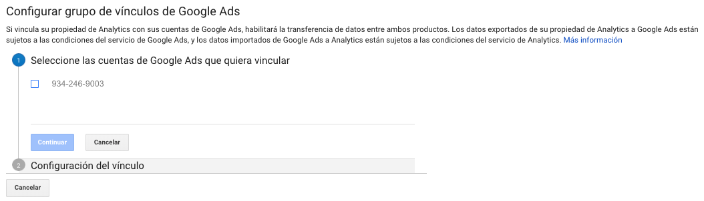

# Vinculación con Google Ads

Desde acá podremos vincular nuestra cuenta de Google Analytics con Google Ads en donde podremos ver los datos de campañas entre ambos productos, como datos de clics y costos de Google Ads, objetivos y transacciones, conversiones multidispositivos o importar métricas de Analytics a Google Ads.

