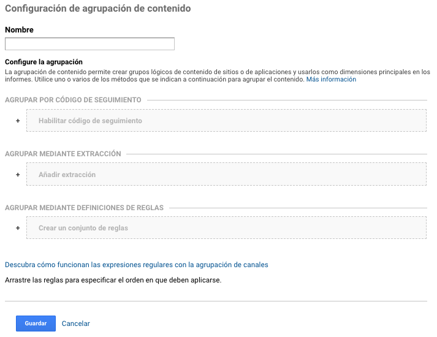

# Agrupación de contenido

La agrupación de contenido nos permite agrupar páginas por ciertas categorías que queramos definir. Esas agrupaciones nos hace poder comparar otros contenidos relacionados por un tema en particular.

Agrupar con código de seguimiento: esta agrupación de contenido se realiza por medio del código de seguimiento, modificando y agregando una linea de código 

Agrupar mediante extracción: permite agrupar contenido agregando una expresión regular o valor que se encuentre en una pantalla, título de la página o url.

Agrupar mediante definición de reglas: permite agrupar contenido generando una regla definida de los valores mencionados anteriormente.

