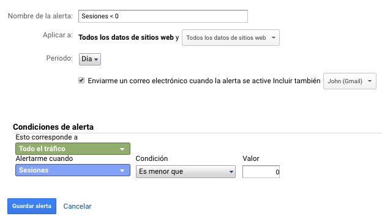

# Alertas personalizadas

Para esta opción podremos crear alertas personalizadas para avisarnos por correo electrónico de posibles acciones ocurridas en nuestra vista de Google Analytics.

Podremos configurar alertas que cumplan con ciertas condiciones de tráfico cuando nuestras sesiones, usuarios, páginas vistas, etc, sean menos de un valor definidos.

Podremos configurar tantas alertas y asignarlas a nuestra vista u a otras vistas de nuestra cuenta.   

Para configurar una alerta personalizada accederemos a nuestra vista en "Alertas personalizadas" y "Nueva alerta".

Cuando la condición ocurra Google Analytics enviara un correo electrónico \(se debe agregar en la configuración de la alerta\) cuando se cumpla la condición.

