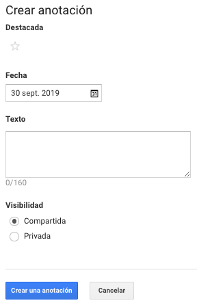

# Anotaciones

Las anotaciones son información de eventos o citas de algún hecho en una fecha determinada.

Podremos crear anotaciones en nuestros informes o dentro de una vista.

Desde la vista ingresamos a "Anotaciones", hacemos clic en el botón "Anotación nueva" y agregamos los siguientes valores:

* Destacada: si queremos destacar la anotación.
* Fecha: la fecha del evento.
* Texto: una descripción del evento ocurrido.
* Visibilidad: compartida con otros usuarios con acceso a esa vista o privada.

