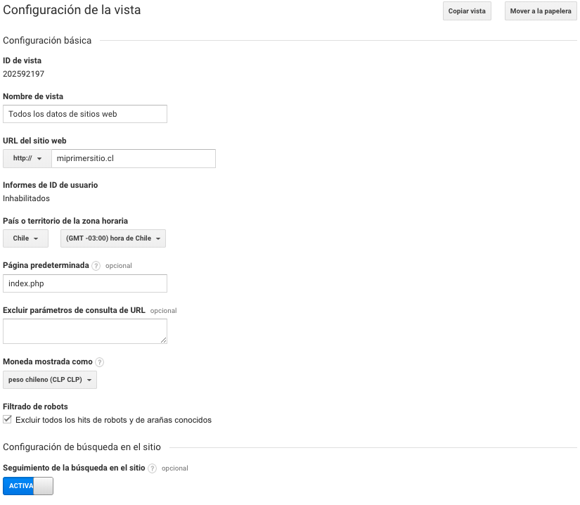
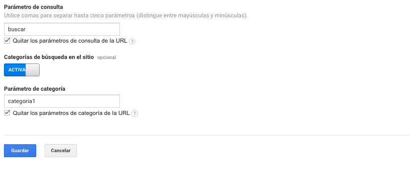

# Configuración de la vista

Una vez creada nuestra nueva cuenta de Google Analytics y con una Propiedad creada debemos comenzar a configurar una Vista para comenzar a analizar los datos.

Por defecto Google Analytics nos crea una vista predeterminada llamada "Todos los datos de sitios web". Esta vista recopila todos los datos de nuestro sitio web. 

En los siguientes pasos revisaremos la configuración de una vista.

Configuración básica

* ID de la vista: podremos ver el ID de la vista.
* Nombre de la vista: podremos definir el nombre de la vista.
* URL del sitio web: podremos agregar la url del sitio web y definir en tipo de protocolo.
* Informes de ID de usuario: podremos saber el estado de los informes de User-ID
* País o territorio de la zona horaria: podremos definir el páis y horario de la zona horaria actual.
* Página predeterminada: podremos definir la página predeterminada del dominio para evitar duplicados de visitas.
* Excluir parámetros de consulta de URL: podremos definir parámetros para excluir en las consultas de la URL.
* Moneda mostrada como: podremos definir la moneda local que mostraremos en los distintos informes.
* Filtrado de robots: podremos excluir los hits de robots y arañas conocidos, principalmente buscadores web.

Configuración de búsqueda en el sitio

* Seguimiento de la búsqueda en el sitio: podremos activar el seguimiento de las consultas de búsqueda de los usuarios y definir el parámetro de búsqueda de una URL para guardar los conceptos en nuestros informes.
* Categorías de búsqueda en el sitio: podremos activar los parámetros de categorías de la búsqueda de una URL. 

