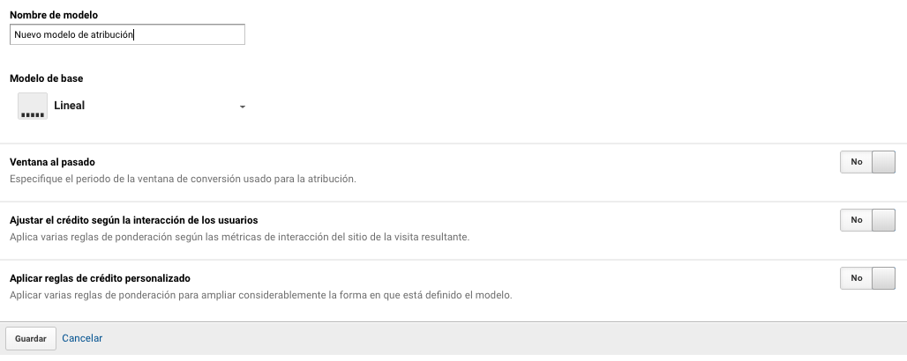

# Configuración de embudos multicanal

En la configuración de embudos multicanal podremos crear modelos de atribución. 

Un modelo de atribución es la forma en como el usuarios van interactuado a través de los distintos canales para llegar a un objetivo final.

Existe 7 modelos de atribución que podremos crear:

* **Lineal**: La atribución se asigna de manera lineal para todos los canales.
* **Primera interacción**: asigna la atribución a la primera interacción del usuario.
* **Última interacción**: asigna la atribución al último canal de interacción del usuario.
* **Declive en el tiempo**: La atribución se asigna a los canales que se acercan a la conversión final en un corto plazo.
* **Según la posición**: modelo híbrido entre la primera y última interacción, la atribución se divide entre ambas interacciones.
* **Último clic indirecto**: atribuye la conversión al último clic indirecto  descartando el tráfico directo.
* **Último clic de Adwords**: atribuye toda la conversión a los anuncios realizados en Adwords.

Para crear un modelo de atribución ingresamos a la vista, configuración de embudos multicanal y hacemos clic en el botón "Nuevo modelo de atribución".

Desde acá agregamos un nombre del modelo de atribución, seleccionamos el tipo de modelo, y agregamos las configuraciones respectivas a cada modelo.

