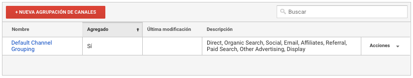
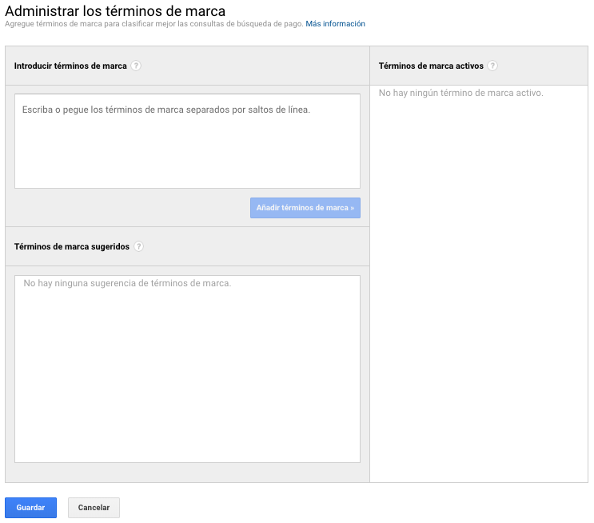

# Configuración del canal

### Agrupación de canales

Las agrupaciones de canales son principalmente fuentes de trafico agrupadas y definidas para determinar y comprobar el rendimiento de cada canal de tráfico.

Para crear una agrupación debemos ingresar a una vista y en "Configuración del canal", "Agrupación de canales". 

Por defecto existe una agrupación de canales llamada: Default Channel Grouping, que es una agrupación de canales por defecto de Google Analytics definidas por sistema.

En el botón "Nueva agrupación de canales" podremos crear nuestro nuevo grupo con una lista de canales definido agregando un nombre, una dimensión. un operador y un valor de la fuente. También podemos agregar más reglas con otras dimensiones con conectores y/o.

### Administrar los términos de marca

En esta sección podremos agregar los términos de marca para clasificar las consultas realizadas por el canal búsqueda de pago.

