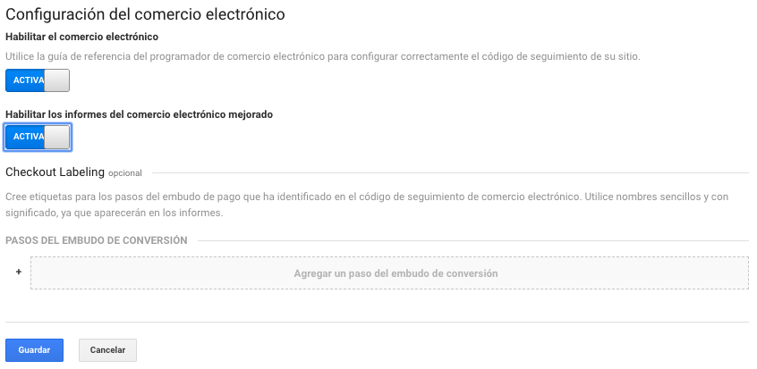

# Configuración del comercio electrónico

Podemos configurar nuevos informes para comercio electrónico mejorado en una vista y etiquetar los pasos de tramitación de una compra.

Para activar la opción debemos ir a la vista, "Configuración de comercio electrónico" y activar las opciones:

* Habilitar el comercio electrónico
* Habilitar los informes del comercio electrónico mejorado.

Dentro de esta configuración podremos crear etiquetas para los pasos de embudos de conversión.

