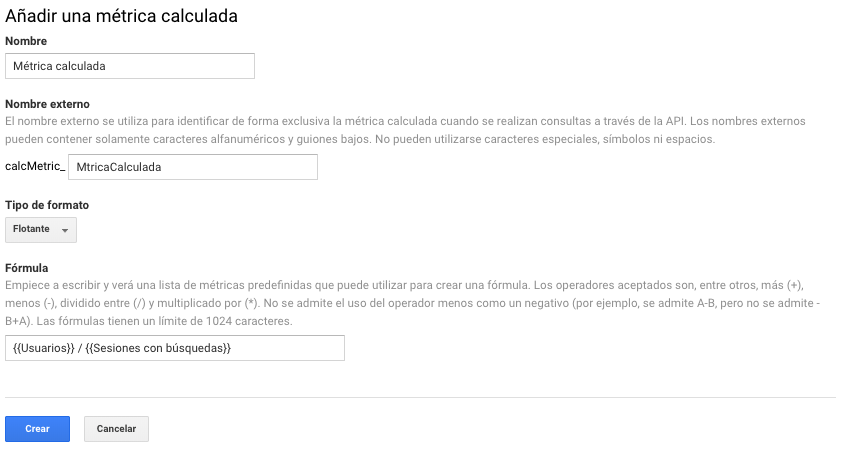

# Métricas calculadas \(BETA\)

Las métricas calculas son métricas definidas por los usuarios creadas a partir del calculo de otras métricas existentes.

Para crear una métrica calculada debemos ingresar a la vista, opción "Métricas calculadas BETA" y hacer clic en el botón: "Nueva métrica calculada".

Agregaremos un nombre de la métrica, un nombre externo \(este nombre se utiliza para identificar la métricas a través de la API\), seleccionaremos un tipo de formato \(Flotante, entero, moneda, tiempo o porcentaje\) y por último seleccionaremos una formula de todas las métricas existentes.

