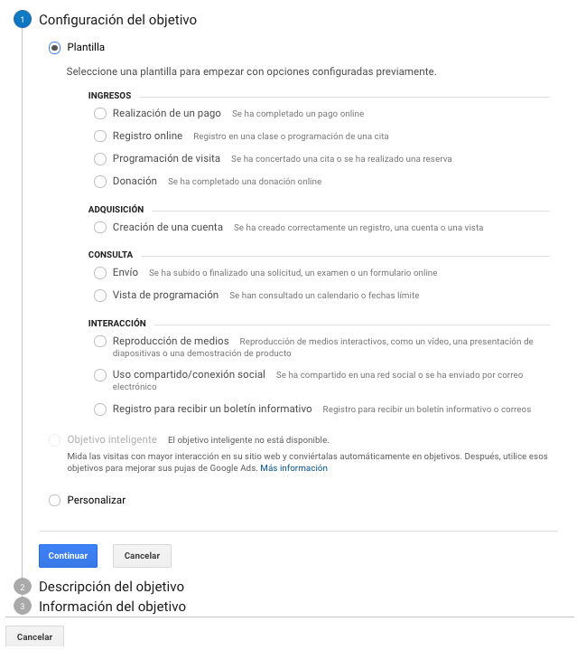

# Objetivos

Los objetivos es la forma en como un usuario realiza una conversión de acuerdo a diferentes acciones en la navegación de la web.

Podremos configurar distintos tipos de objetivos predefinidos en Google Analytics. Entre esas opciones tenemos:

* Por plantilla. opciones pre-configuradas como: de ingresos \(para e-commerce\), adquisición, consulta o interacción.
* Por objetivo inteligente. Google Analytics considera las visitas con mejor interacción y convierte automáticamente esos datos en un objetivo. 
* Personalizadas.

Al crear un configuración personalizada, podemos elegir entre 4 tipos:

* Destino
* Duración
* Páginas/Pantallas por sesión
* Evento
* Objetivo inteligente

En la información del objetivo podemos elegir la página de destino final en donde se realizara la conversión.

También podemos dar un valor o generar un embudo de conversión agregando las paginas por cada paso.

