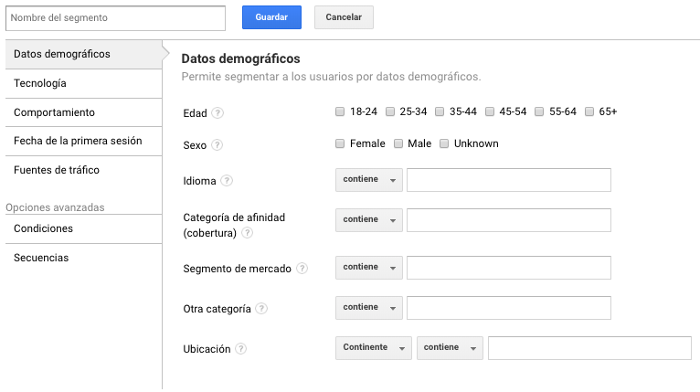

# Segmentos

Esta opción permite crear segmentos o filtros de información para nuestros informes de Google Analytics.

Al crear un segmento podremos filtrar datos de las dimensiones y métricas agregando todos los elementos necesarios para obtener datos específicos.

Entre esos datos, podremos agregar:

* Datos demográficos: Permite segmentar a los usuarios por datos demográficos.
* Tecnología: Permite segmentar a los usuarios por características tecnológicas de la web y dispositivos móviles.
* Comportamiento: Permite segmentar a los usuarios por frecuencia de visitas y de transacciones.
* Fecha de la primera sesión: Permite segmentar a los usuarios por primera visita.
* Fuentes de tráfico: Permite segmentar a los usuarios por que fuente le han encontrado.

También podremos agregar opciones avanzadas:

* Condiciones: Permite segmentar a los usuarios y/o sus sesiones seleccionado un tipo de dimensión
* Secuencias: Permite segmentar a los usuarios y/o sus sesiones por la naturaleza secuencial.

Los segmentos se pueden crear mezclando todos los datos posibles.

