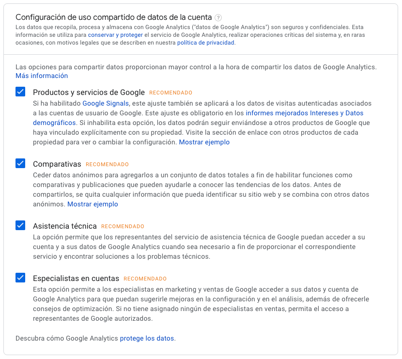
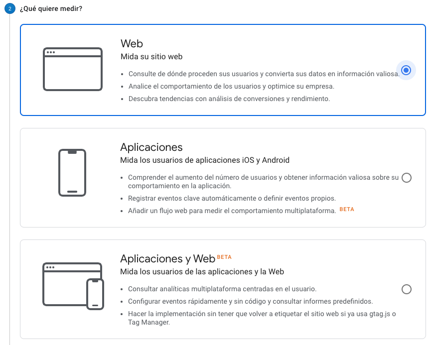
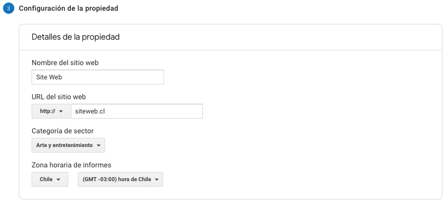

# Crear una cuenta

Una vez que ingresa con una cuenta de Google Analytics deberá hacer clic en el botón "Registrarse".

Si es la primera vez en crear una cuenta, al momento de ingresar le solicitara crear una nueva "Cuenta" para su organización.

Debe ingresar el nombre de su organización con la que quiera medir sus datos y seleccionar las distintas opciones para compartir los datos con Google. 

El segundo paso es definir qué vamos a medir. Las opciones son:

1. Web
2. Aplicaciones
3. Aplicaciones y Web \(beta\)

El tercer y último paso es configurar la propiedad. En este paso debemos crear un nombre de propiedad que puede ser el nombre de nuestro sitio web o nuestro sistema.

Agregamos tambien la URL de nuestro sitio web, una categoría y la zona horaria correspondiente.

Por último al agregar los campos necesarios en las tres etapas, deberá aceptar el "Acuerdo de Condiciones de Servicio de Google Analytics"

