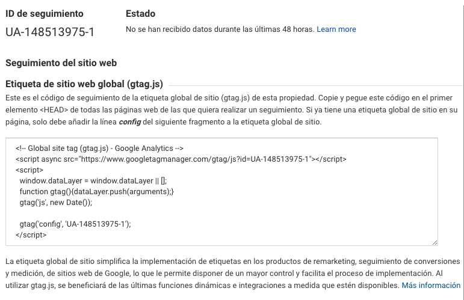
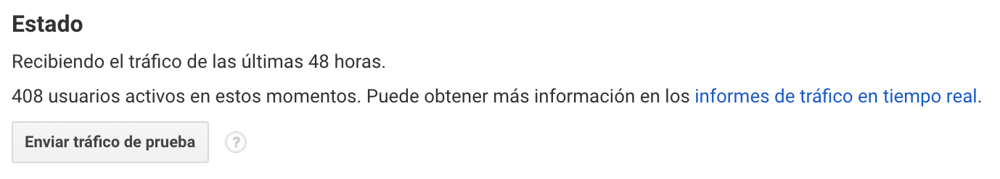

# Instalar y verificar nuestro código de seguimiento

Una vez creada la cuenta y su configuración básica, es momento de instalar el código de seguimiento de Google Analytics.

El código de seguimiento de Google Analytics es un script que recoge y envía datos a Analytics de un sitio web o aplicación móvil.

La versión actual del código o script de Google Analytics es Gtag o Global Site Tag \(gtag.js\). Es un nuevo código actualizado desde el 2017 que engloba todas la suite de Google \(Analytics, Ads y Marketing Platform\) logrando más integridad entre estas plataformas.

La implementación para un sitio web sigue siendo igual que es las versiones anteriores, esto es dentro del código HTML justo bajo la etiqueta &lt;head&gt;

El código de seguimiento lo encontramos en:

* Administrar
* Propiedad: seleccionar sitio web o aplicación
* Información de seguimiento
* Código de seguimiento

El ID de seguimiento es el identificador asignado a nuestra propiedad y a nuestro sitio web. Todo ID de seguimiento comienza con las iniciales UA que corresponde a Universal Analytics.

### Instalación en Wordpress

Para instalar el código de seguimiento en el CMS Wordpress debemos ingresar al template &lt;header.php&gt; de nuestra web. Esto es en "Apariencia", "Editor", abrimos el archivo header.php y localizamos la apertura de la etiqueta &lt;head&gt;, seguida de esta etiqueta pegamos el script o código de seguimiento de Google Analytics.

### Verificación de código de seguimiento

Podemos verificar si nuestra propiedad de Google Analytics esta recibiendo los datos del código de seguimiento instalado. Debemos ingresar a "Propiedad", seleccionar nuestra propiedad o sitio web, ir a "Información de seguimiento" y dentro de "Código de seguimiento" ver "Estado".

Tambien existen otras formas de verificar si nuestro código de seguimiento se encuentra correctamente instalado.

* Mediante la extensión de Chrome Tag Assitant
* Desde el Informe "En tiempo real"

