# Configuraciones generales de los informes

En los distintos informes de Google Analytics existirán configuraciones y opciones distintas que nos permitirán personalizar la información mostrada. Entre esas opciones se encuentran:

## Muestreo de los informes predeterminados

Dentro de los paneles de informe en Google Analytics, cerca del título del informe encontraremos una opción para para definir el tipo de muestreo de los informes. Dependiendo de la cantidad de datos que recopilemos podremos seleccionar dos opciones:

**Mayor precisión**: utiliza el tamaño de muestra más grande para obtener datos más precisos en nuestros informes de analytics. 

**Respuesta más rápida**: que utiliza un tamaño de muestra más pequeño para obtener los datos de manera más rápida. 

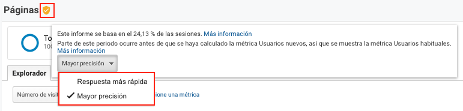

## Guardar

Desde esta opción podremos guardar los informes predeterminados o informes con filtros y segmentos asignados. Los informes guardados quedaran en el panel de "Personalización" e "Informes guardados".

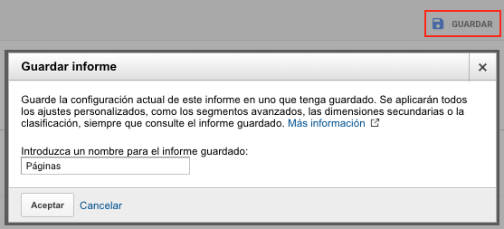

## Exportar

Desde esta opción podremos los datos de nuestros informes en formatos como:

* PDF
* Hojas de cálculo de Google
* Excel \(xlsx\)
* CSV

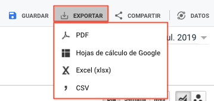

## Compartir

Desde esta opción podremos compartir los informes de analytics mediante correo electrónico en formatos PDF, Excel o CSV y programarlos para entregarlos periódicamente.

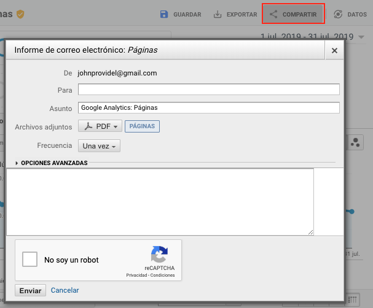

## Datos

Desde esta opción podremos todos los datos de Analytics Intelligence que es un conjunto de funciones que utilizan aprendizaje automático con el fin de ayudarnos a obtener sugerencias, respuestas a preguntas, datos generales de acuerdo al uso que le demos a Google Analytics.

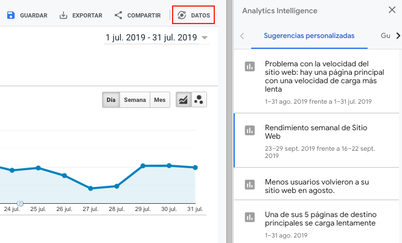

## Añadir un segmento

En los informes de Google Analytics podremos añadir los segmentos credos para realizar comparaciones de nuestros datos. 

Por defecto siempre habrá un segmento "Todos los usuarios".

Podremos agregar hasta 3 segmentos distintos para comparar nuestros datos.

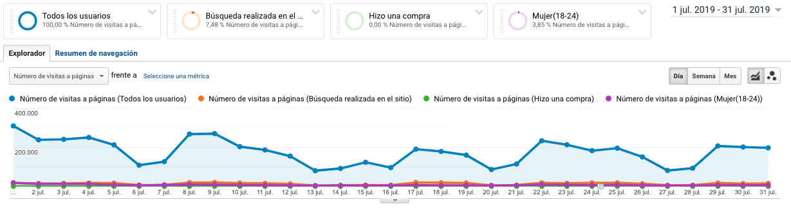

## Seleccionar periodos de tiempo

En los informes de Google Analytics podremos seleccionar un periodo de tiempo para consultar nuestros datos.

Tambien podremos realizar comparaciones con otro periodo de tiempo.

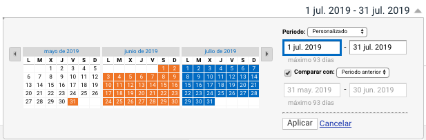

## Explorador

El explorador de datos nos mostrará de forma gráfica las métricas que estemos consultando. En algunos informes podremos seleccionar la métrica y compararla con otra, como tambien ver los datos por día, semana o mes. Tambien podremos seleccionar un tipo de gráfico de líneas \(por defecto\) o un gráfico dinámico. Por último  podremos ver y agregar anotaciones para destacar una fecha de un suceso ocurrido.

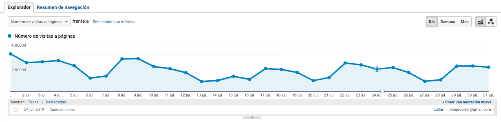

## Selección de dimensiones

Dentro de algunos informes podremos seleccionar una dimensión secundaria para incluirlo en el listado de datos existentes y comparar datos de ambas dimensiones.

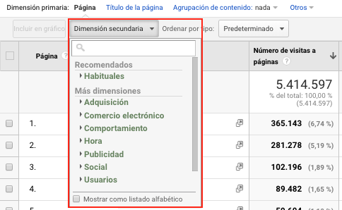

## Buscador de dimensiones o métricas

Dentro de los informes de Google Analytics podremos realizar una búsqueda avanzada de dimensiones o métricas para filtrar datos según las condiciones que agreguemos. Podremos realizar consultas de combinaciones entre dimensiones o métricas.

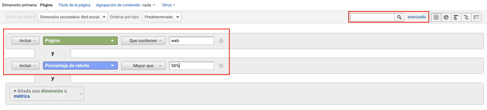

## Tabla de datos y visualización de datos

Dentro de los informes tambien tendremos una tabla de datos que nos mostrara información en 5 formatos para visualizar esa información y así poder realizar distintas comparaciones.

**Gráfico de datos**

Es la vista de datos predeterminada y más usada. Nos muestra los datos en forma de tabla. 

**Porcentaje** 

Muestra un gráfico circular que indica la contribución de la métrica seleccionada.

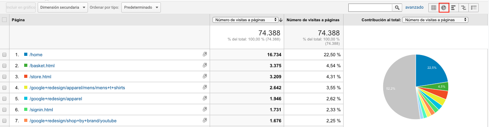

**Rendimiento**

Muestra un gráfico de barras horizontal que indica el rendimiento de la métrica seleccionada.

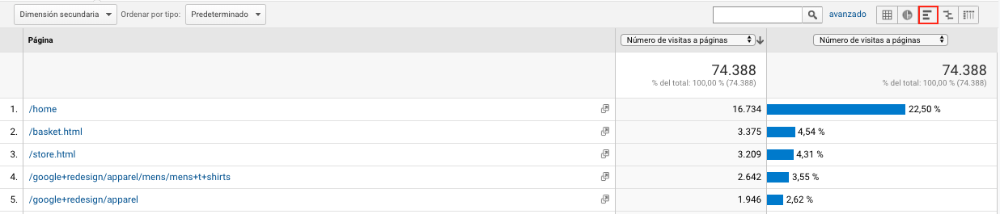

**Comparación**

Muestra un gráfico de barras que representa el rendimiento de las métricas seleccionadas en comparación con el promedio del sitio web.

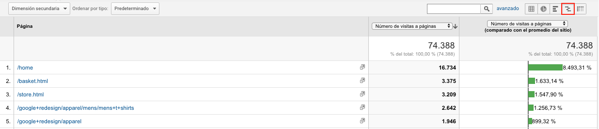

**Tabla dinámica**

Muestra información en función de una segunda dimensión.

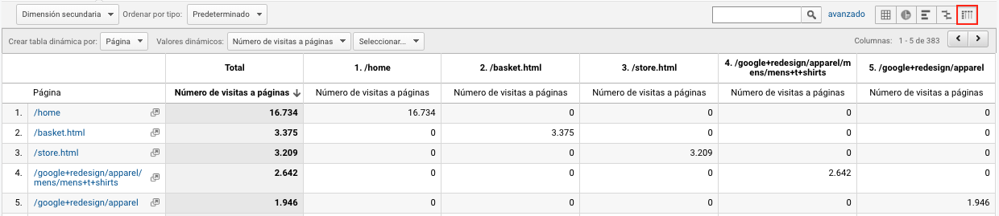

