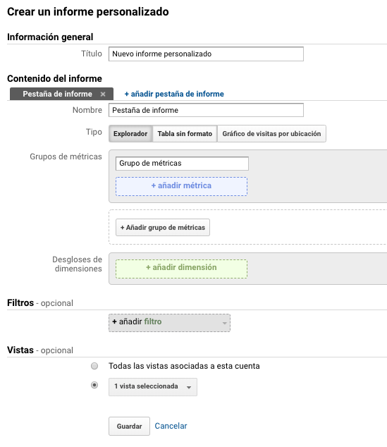

# Informes personalizados

Son informes con distintos tipos de datos pudiendo personalizarlos de acuerdo a las métricas que necesitemos mostrar. 

La configuración const de:

* Información general
* Contenido del informe: podremos seleccionar el tipo, el grupo de métricas, desglose de dimensiones, filtros y vistas.

