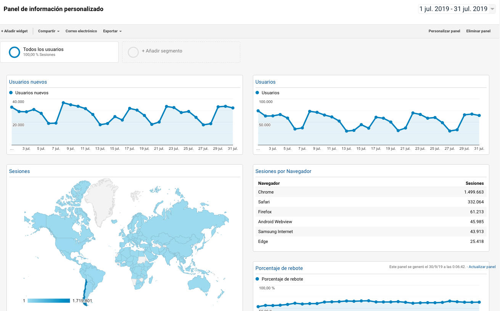

# Paneles

Los paneles son un conjunto de datos organizados en cuadros con información de métricas de distintos informes de Google Analytics, podremos moverlos y organizarlos para obtener un dashboard personalizado.

